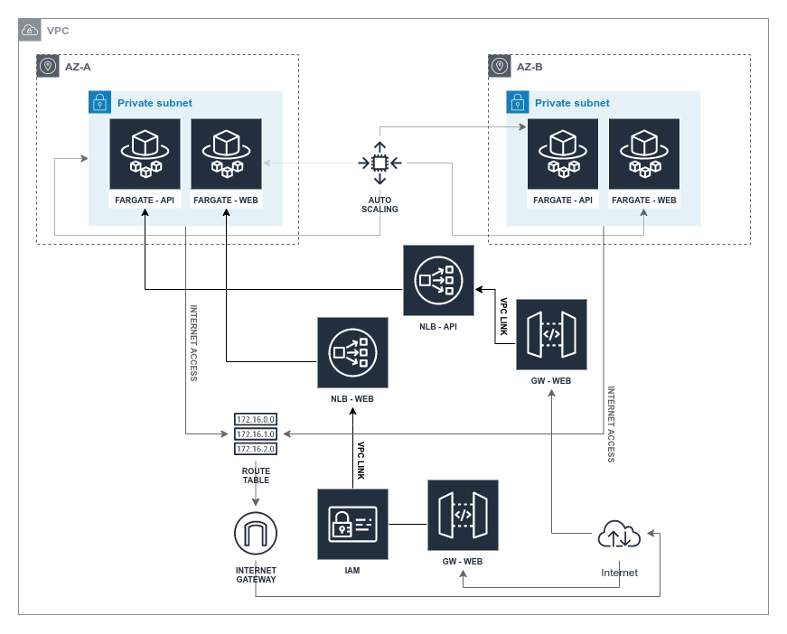

# Fargate POC with IAM authentication
This project creates the following resources:
 - 1 VPC;
 - 2 Availability Zones;
 - 2 Subnets(one per AZ);
 - 2 NAT Gateways(one per AZ);
 - 2 Applications(one with AWS_IAM authentication and other without);
 - 2 APIs on API Gateway(one per Application);
 - 2 NLBs(one per Application);
 - 2 EIPs(one per NAT Gateway);
 - 2 ECS Clusters(one per Application);
 - 2 ECS Tasks(one per Application);
 - 2 ECS Services(one per Application);



### Deploy VPC - PUB/PRIV
```
aws cloudformation create-stack \
  --template-body file://cfm/vpc-fargate.yaml \
  --stack-name fargate-poc-aw-vpc
```

### Deploy RDS - MySQL
```
aws cloudformation create-stack \
  --template-body file://cfm/dbs-fargate.yaml \
  --stack-name fargate-poc-aw-dbs
```

### Deploy ECS - API
```
aws cloudformation create-stack \
  --template-body file://cfm/ecs-fargate.yaml \
  --capabilities CAPABILITY_NAMED_IAM \
  --stack-name fargate-poc-ct-api \
  --parameters ParameterKey=Image,ParameterValue=<public-repository>/fargate-api \
  ParameterKey=ServiceName,ParameterValue=fargate-poc-ct-api
```

### Deploy ECS - WEB
```
aws cloudformation create-stack \
  --template-body file://cfm/ecs-fargate.yaml \
  --capabilities CAPABILITY_NAMED_IAM \
  --stack-name fargate-poc-ct-web \
  --parameters ParameterKey=Image,ParameterValue=<public-repository>/fargate-web \
  ParameterKey=ServiceName,ParameterValue=fargate-poc-ct-web \
  ParameterKey=MinContainers,ParameterValue=1 
```

### Deploy API - API Gateway
```
aws cloudformation create-stack \
  --template-body file://cfm/api-gateway.yaml \
  --stack-name fargate-poc-gw-api \
  --parameters ParameterKey=ECSStackName,ParameterValue=fargate-poc-ct-api
```

### Deploy WEB - API Gateway
```
aws cloudformation create-stack \
  --template-body file://cfm/api-gateway.yaml \
  --stack-name fargate-poc-gw-web \
  --parameters ParameterKey=ECSStackName,ParameterValue=fargate-poc-ct-web \
  ParameterKey=ApplyIAMAuth,ParameterValue=false
```